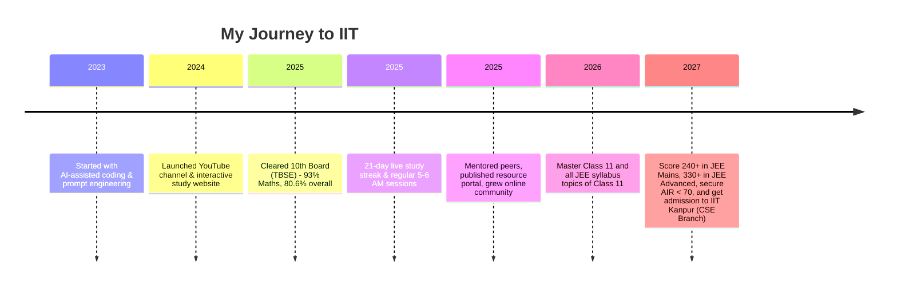

  

<h1 align="center">
    
  Hi, I'm Deep Dey 
  
</h1>

  <b>AI-Powered Learner | JEE Aspirant | Content Creator | Building Tomorrow, Today</b> 
  

 

---

---

  

  

---

## 📌 Table of Contents
- 🧡 [About Me 🚀](#about-me-)
  - 💖 [🎯 My Mission & Ambitious Goals](#-my-mission--ambitious-goals)
- 💙 [⚙️ Tech Stack](#️-tech-stack)
  - 💚 [🌐 Front-end & Web](#-front-end--web)
  - 💜 [🧠 Back-end & Database](#-back-end--database)
  - 💛 [🎥 Media & Content Creation](#-media--content-creation)
  - 💗 [☁️ Workflow, Hosting & Cloud](#-workflow-hosting--cloud)
- 💫 [⭐ Pinned Projects](#pinned-projects-)
- 💚 [📁 Other Projects](#other-projects-️)
- 🩷 [🏆 Journey & Milestones](#journey--milestones-)
  - 💛 [🏅 Key Achievements](#key-achievements)
- 💜 [💡 My Philosophy](#my-philosophy-)
- 💙 [🤝 Get Involved](#get-involved-)
- 💚 [🌐 Contact & Socials](#contact--socials-)
- 💖 [🌻 Why Follow My Journey?](#why-follow-my-journey-)

---

## About Me 🚀

Hello! I’m **Deep Dey**, currently a Class 11 CBSE student from Tripura, with my eyes set on cracking **JEE 2027** and earning a seat at **IIT Kanpur (CSE branch)**.  
My journey is defined by ambition, relentless discipline, and a modern approach to learning and building — by leveraging the power of Artificial Intelligence.

### 🎯 My Mission & Ambitious Goals

- **2026:** Achieve mastery in all Class 11 topics and cover the entire JEE syllabus for Class 11.
- **2027:** Score **240+ in JEE Mains** and **330+ in JEE Advanced**, to secure an **All India Rank (AIR) under 70** and gain admission to **IIT Kanpur (CSE Branch)**.

I am building a path to the IIT dream not only through hard work and consistency, but also by **embracing new technology and rethinking how students can use AI as an academic and creative accelerator**.

---

## 🛠️ Tech Stack

### 🎨 **Front-end & Web**

---

### ⚙️ **Back-end & Database**

---

### 🎬 **Media & Content Creation**

---

### 🧰 **Workflow, Hosting & Cloud**

[![Quicklink](https://img.shields.io/badge/Quicklink-URL%20Shortener-00E5FF?style=for-the-badge&logo=data:image/svg+xml;base64,PHN2ZyB3aWR0aD0iMTI4IiBoZWlnaHQ9IjEyOCIgdmlld0JveD0iMCAwIDEyOCAxMjgiIGZpbGw9Im5vbmUiIHhtbG5zPSJodHRwOi8vd3d3LnczLm9yZy8yMDAwL3N2ZyI+PHJlY3Qgd2lkdGg9IjEyOCIgaGVpZ2h0PSIxMjgiIHJ4PSIyNCIgZmlsbD0iIzBhMGExYSIvPjxnIHRyYW5zZm9ybT0ic2NhbGUoMy41NSkgdHJhbnNsYXRlKDgsIDgpIj48cGF0aCBzdHJva2UtbGluZWNhcD0icm91bmQiIHN0cm9rZS1saW5lam9pbj0icm91bmQiIGQ9Ik0xMy4xOSA4LjY4OGE0LjUgNC41IDAgMDEuMjQyIDcuMjQ0bC00LjUgNC41YTQuNSA0LjUgMCAwMS02LjM2NC02LjM2NGwxLjc1Ny0xLjc1N20xMy4zNS0uNjIybDEuNzU3LTEuNzU3YTQuNSA0LjUgMCAwMC02LjM2NC02LjM2NGwtNC41IDQuNWE0LjUgNC41IDAgMDAxLjI0MiA3LjI0NCIgc3Ryb2tlPSIjMDBlNWZmIiBzdHJva2Utd2lkdGg9IjEuNSIvPjxwYXRoIHN0cm9rZS1saW5lY2FwPSJyb3VuZCIgc3Ryb2tlLWxpbmVqb2luPSJyb3VuZCIgZD0iTTUuMjUgNS4yNWgxMy41IiBzdHJva2U9IiMwMGU1ZmYiIHN0cm9rZS13aWR0aD0iMS41Ii8+PHBhdGggc3Ryb2tlLWxpbmVjYXA9InJvdW5kIiBzdHJva2UtbGluZWpvaW49InJvdW5kIiBkPSJNNy4yNSAxOC43NWgxMy41IiBzdHJva2U9IiMwMGU1ZmYiIHN0cm9rZS13aWR0aD0iMS41Ii8+PC9nPjwvc3ZnPg==)](https://qlynk.vercel.app)

---

## Pinned Projects ⭐

| Project | Description | Link |
|---------|-------------|------|
| 🎯 **deepdey** | Modern, interactive learning resources and JEE study tools. | [deepdey Repo](https://github.com/deepdeyiitgn/deepdey) |
| 🚀 **deydeep** | Personal experiments, AI-built web and educational utilities. | [deydeep Repo](https://github.com/deepdeyiitgn/deydeep) |
| 💖 **donation** | Platform for donations and supporter engagement, with personalized thank-you pages. | [donation Repo](https://github.com/deepdeyiitgn/donation) |
| 🔒 **Verify & Support** | A modular, client-side human verification system featuring multiple challenge modules (text, math, slider, moving dot), session management (6-hour token), and secure redirection. Fully static, professional, and deployable on GitHub Pages. | [support & verify Repo](https://github.com/deepdeyiitgn/support-page-deepdeyiitk.com) |
| 🤖 **deepdey-discord_bot** | Modular Discord bot • Study tools, quizzes, reminders, games. Want to know All Features, Visit: [Click Here](https://deepdey-discord-bot.vercel.app) | [Bot's Repo](https://github.com/deepdeyiitgn/deepdey-discord_bot) |
| 🔗 **Quick Link** | A modern, fast, and easy-to-use URL shortener. Create custom, memorable short links for any website. Features include optional custom aliases and automatic expiration of links after 7 days., Visit: [Click Here](https://quick-link-url-shortener.vercel.app/) | [Shortner's Repo](https://github.com/deepdeyiitgn/QuickLink-URL-Shortener) |
---

## Other Projects 🗂️

- 🌐 **[www.deepdeyiitk.com](https://www.deepdeyiitk.com)** – My personal site: resources, blog posts, and project hub for students and JEE aspirants.
- 📚 **Resource Portals** – Study material downloads, both free and premium, with secure access and interactive support.
- 🎨 **Custom Visual Effects** – Confetti, animated blobs, sparkles, and glassmorphism for better user engagement.
- 🏦 **Payment Systems** – Razorpay integration for donations and digital products with instant access and custom thank-you pages.

---

## Journey & Milestones 🏆

### Key Achievements
- **Consistent Daily Discipline:** 5–6 AM live study sessions, 21-day streaks, and strict timetable follow-through.
- **Peer Mentorship:** Guiding fellow aspirants and sharing my journey and tools with the community.
- **YouTube Growth:** Inspiring others through live prep, unboxings, and productivity content.

---

## My Philosophy 💡

**I am not a traditional coder.**  
I do not write complex code by hand or have mastery over coding languages in the way expert programmers do. Instead, I **leverage the power of AI and prompt engineering** to generate efficient, high-quality code for my projects, websites, and apps. My real skill is knowing how to design, prompt, and shape AI-generated solutions to bring my ideas to life.  
- I am proof that **discipline and smart use of technology can fill the gaps** where traditional skills are still developing.
- I believe that in the modern world, being an “AI-native” creator is as valuable as being a manual coder.

---

## Get Involved 🤝

- **Fork | Enhance | PR:**  
  Contribute to my projects—especially if you love AI, UI/UX, or educational tech!
- **Suggest Ideas:**  
  I am always open to new project ideas, collaborations, and feedback.
- **Join the Journey:**  
  Study, build, or learn with me—catch my daily [YouTube Livestreams](https://www.youtube.com/@deepdeyiit)!
- **Share & Inspire:**  
  If my journey helps you, share it with others or join the community!

---

## Contact & Socials 🌐

  
  
  
  
  
  
  
  
  

---

## Why Follow My Journey? 🌟

- 🎥 **Live Prep:** Track my real JEE sessions & milestones as they happen.
- 🤖 **AI-Powered Projects:** See how modern students use AI to build and learn, without deep manual coding skills.
- 🧑‍💻 **Open Projects:** Watch ideas become reality with the help of new technology.
- 💡 **Motivation & Discipline:** Get inspired to develop productivity, focus, and consistency.
- 🌎 **Community:** Join a growing group of learners, builders, and dreamers.

---

 
  
 

---

 
  
  

---

 
  
  

---

 
  

 
  

  <em>Made with ❤️, AI power, and relentless focus by <b>Deep Dey</b></em>

 
  
  

