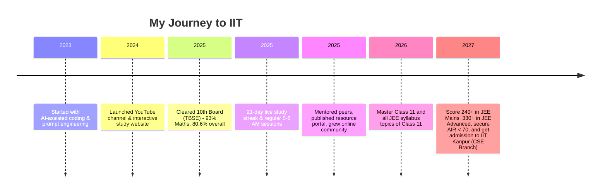

  

<h1 align="center">Hi, I'm Deep Dey </h1>

  <b>AI-Powered Learner | JEE Aspirant | Content Creator | Building Tomorrow, Today</b> 
  

 

---

## 📌 Table of Contents
- [About Me](#about-me-🚀)
- [Tech Stack](#️-tech-stack)
- [Pinned Projects](#pinned-projects-⭐)
- [Other Projects](#other-projects-🗂️)
- [Journey & Milestones](#journey--milestones-🏆)
- [My Philosophy](#my-philosophy-💡)
- [Get Involved](#get-involved-🤝)
- [Contact & Socials](#contact--socials-🌐)
- [Why Follow?](#why-follow-my-journey-🌟)

---

## About Me 🚀

Hello! I’m **Deep Dey**, currently a Class 11 CBSE student from Tripura, with my eyes set on cracking **JEE 2027** and earning a seat at **IIT Kanpur (CSE branch)**.  
My journey is defined by ambition, relentless discipline, and a modern approach to learning and building — by leveraging the power of Artificial Intelligence.

### 🎯 My Mission & Ambitious Goals

- **2026:** Achieve mastery in all Class 11 topics and cover the entire JEE syllabus for Class 11.
- **2027:** Score **240+ in JEE Mains** and **330+ in JEE Advanced**, to secure an **All India Rank (AIR) under 70** and gain admission to **IIT Kanpur (CSE Branch)**.

I am building a path to the IIT dream not only through hard work and consistency, but also by **embracing new technology and rethinking how students can use AI as an academic and creative accelerator**.

---

## 🛠️ Tech Stack

**Front-end & Web:**  

**Back-end & Tools:**  

**Media & Content:**  

**Workflow & Community:**  

---

## Pinned Projects ⭐

| Project | Description | Link |
|---------|-------------|------|
| 🎯 **deepdey** | Modern, interactive learning resources and JEE study tools. | [deepdey Repo](https://github.com/deepdeyiitgn/deepdey) |
| 🚀 **deydeep** | Personal experiments, AI-built web and educational utilities. | [deydeep Repo](https://github.com/deepdeyiitgn/deydeep) |
| 💖 **donation** | Platform for donations and supporter engagement, with personalized thank-you pages. | [donation Repo](https://github.com/deepdeyiitgn/donation) |
| 🔒 **Verify & Support** | A modular, client-side human verification system featuring multiple challenge modules (text, math, slider, moving dot), session management (6-hour token), and secure redirection. Fully static, professional, and deployable on GitHub Pages. | [support & verify Repo](https://github.com/deepdeyiitgn/support-page-deepdeyiitk.com) |

---

## Other Projects 🗂️

- 🌐 **[www.deepdeyiitk.com](https://www.deepdeyiitk.com)** – My personal site: resources, blog posts, and project hub for students and JEE aspirants.
- 📚 **Resource Portals** – Study material downloads, both free and premium, with secure access and interactive support.
- 🎨 **Custom Visual Effects** – Confetti, animated blobs, sparkles, and glassmorphism for better user engagement.
- 🏦 **Payment Systems** – Razorpay integration for donations and digital products with instant access and custom thank-you pages.

---

## Journey & Milestones 🏆

### Key Achievements
- **Consistent Daily Discipline:** 5–6 AM live study sessions, 21-day streaks, and strict timetable follow-through.
- **Peer Mentorship:** Guiding fellow aspirants and sharing my journey and tools with the community.
- **YouTube Growth:** Inspiring others through live prep, unboxings, and productivity content.

---

## My Philosophy 💡

**I am not a traditional coder.**  
I do not write complex code by hand or have mastery over coding languages in the way expert programmers do. Instead, I **leverage the power of AI and prompt engineering** to generate efficient, high-quality code for my projects, websites, and apps. My real skill is knowing how to design, prompt, and shape AI-generated solutions to bring my ideas to life.  
- I am proof that **discipline and smart use of technology can fill the gaps** where traditional skills are still developing.
- I believe that in the modern world, being an “AI-native” creator is as valuable as being a manual coder.

---

## Get Involved 🤝

- **Fork | Enhance | PR:**  
  Contribute to my projects—especially if you love AI, UI/UX, or educational tech!
- **Suggest Ideas:**  
  I am always open to new project ideas, collaborations, and feedback.
- **Join the Journey:**  
  Study, build, or learn with me—catch my daily [YouTube Livestreams](https://www.youtube.com/@deepdeyiit)!
- **Share & Inspire:**  
  If my journey helps you, share it with others or join the community!

---

## Contact & Socials 🌐

  
  
  
  
  
  
  
  
  

---

## Why Follow My Journey? 🌟

- 🎥 **Live Prep:** Track my real JEE sessions & milestones as they happen.
- 🤖 **AI-Powered Projects:** See how modern students use AI to build and learn, without deep manual coding skills.
- 🧑‍💻 **Open Projects:** Watch ideas become reality with the help of new technology.
- 💡 **Motivation & Discipline:** Get inspired to develop productivity, focus, and consistency.
- 🌎 **Community:** Join a growing group of learners, builders, and dreamers.

---

  <em>Made with ❤️, AI power, and relentless focus by <b>Deep Dey</b></em>

  

