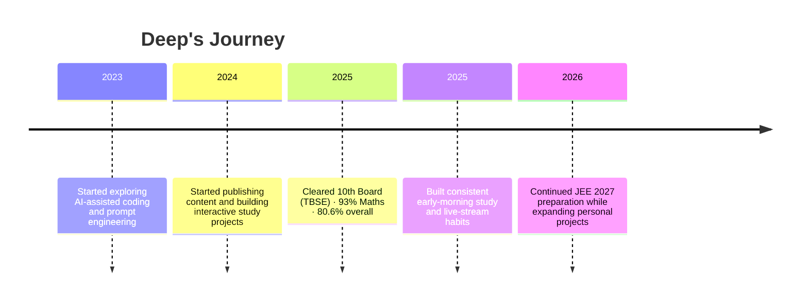

  

<h1 align="center">
  
  Hi, I'm Deep Dey
</h1>

  <b>Class 12 Student · AI-Assisted Builder · JEE 2027 Aspirant · Content Creator</b> 
  

  
  
  
  

---

## 📌 Contents

- 👋 [About Me](#about-me)
- 🛠️ [Tech Stack](#️-tech-stack)
- ⭐ [Featured Projects](#-featured-projects)
- 🎧 [Spotify](#-spotify)
- 📊 [GitHub Activity](#-github-activity)
- 🏆 [Journey](#-journey)
- 💡 [How I Build](#-how-i-build)
- 🤝 [Get Involved](#-get-involved)
- 🌐 [Contact](#-contact)

---

## 👋 About Me

I’m **Deep Dey**, a Class 12 student from Tripura preparing for **JEE 2027** while building websites, utilities, experiments, and small digital products.

I use **AI-assisted development and prompt engineering** to move quickly from an idea to a working system. Along the way, I care about product thinking, UI, automation, experimentation, and actually shipping things people can use.

My GitHub is a mix of **learning, building, documenting experiments, and sharing useful projects**.

---

## 🛠️ Tech Stack

<b>🌐 Web & App Development</b>

 

<b>☁️ Data, Cloud & Workflow</b>

 

<b>🎨 Creative & AI</b>

 

---

## ⭐ Featured Projects

| Project | What it is | Link |
| --- | --- | --- |
| 🎯 **deepdey** | Learning resources and JEE-focused study tools. | [Repository](https://github.com/deepdeyiitgn/deepdey) |
| 🔗 **QuickLink** | Fast URL shortener with custom aliases and utility-focused features. | [Repository](https://github.com/deepdeyiitgn/QuickLink) · [Live](https://qlynk.vercel.app/) |
| ⌚ **TransparentClock** | Minimal always-on-top study clock and focus utility. | [Repository](https://github.com/deepdeyiitgn/Clock-Overlays/) · [Live](https://clock.qlynk.me/) |
| 🌌 **My Portfolio** | Personal portfolio, journal, and system-architecture themed web platform. | [Repository](https://github.com/deepdeyiitgn/My-Portfolio) · [Live](https://deepdey.vercel.app/) |
| ☁️ **Qlynk Node Master** | Private cloud storage and media infrastructure experiments. | [Repository](https://github.com/deepdeyiitgn/static-files) · [Live](https://static.qlynk.me/) |
| 🤖 **Study Bot** | Discord study utilities, quizzes, reminders, and community features. | [Repository](https://github.com/deepdeyiitgn/studybot) |

### 🗂️ More Projects

I also experiment with resource portals, media systems, payment flows, UI effects, automation, and other small internet projects across my repositories.

---

## 🎧 Spotify

A live view of what I’ve been listening to, powered by my own Spotify integration.

<h3>🎧 Now Playing</h3>

<h3>🩷 Last Played Songs</h3>

<h3>🔥 Top Songs</h3>

<h3>🎤 Top Artists</h3>

<h3>📊 Spotify Overview</h3>

<h3>🎵 Spotify Main</h3>

---

## 📊 GitHub Activity

  

  
  

---

## 🏆 Journey

```mermaid
timeline
    title Deep's Journey
    2023 : Started exploring AI-assisted coding and prompt engineering
    2024 : Started publishing content and building interactive study projects
    2025 : Cleared 10th Board (TBSE) · 93% Maths · 80.6% overall
    2025 : Built consistent early-morning study and live-stream habits
    2026 : Continued JEE 2027 preparation while expanding personal projects
```

---

## 💡 How I Build

I’m an **AI-assisted builder**.

I use AI and prompt engineering to accelerate implementation, but the work is not only about generating code. I focus on **ideas, product structure, UX, system flow, experimentation, debugging, and shipping**.

The goal is simple: turn a useful idea into something real, test it, improve it, and learn from the process.

---

## 🤝 Get Involved

- **Explore:** Try the projects and see what I’m building.
- **Contribute:** Open an issue, suggest an improvement, or submit a PR where the repository is open for contributions.
- **Connect:** Follow the journey through my projects, content, and live study sessions.

---

## 🌐 Contact

  
  
  
  
  
  
  

---

  <em>Made with ❤️, AI assistance, curiosity, and consistency by <b>Deep Dey</b></em>

  

